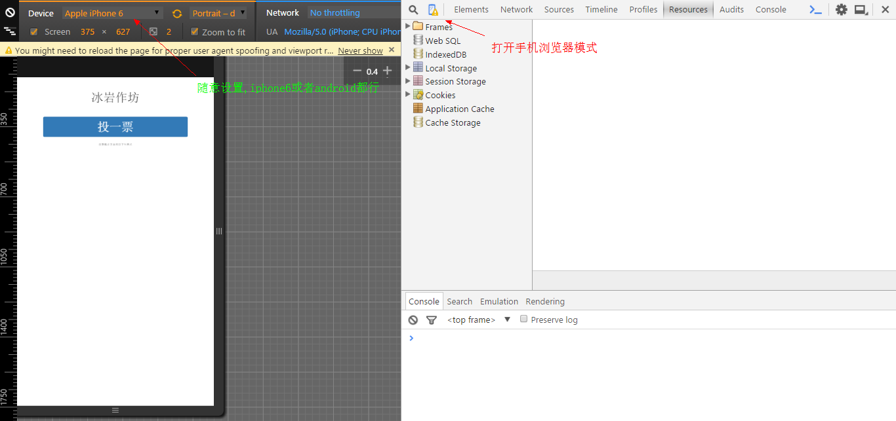
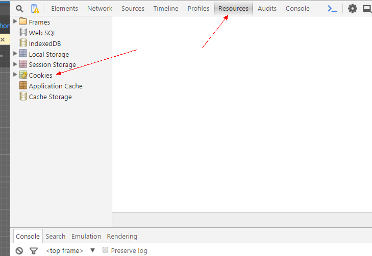
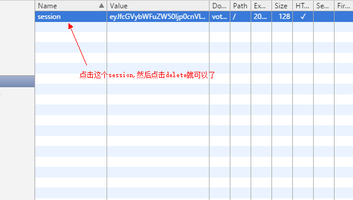

####刷票过程
1.iphone手机可以使用无痕模式直接刷票 
2.没有iphone的或者不支持手机端的可以使用chrome浏览器
_ _ _

>实现步骤

1.复制网址[http://vote.sky31.com/teams_vote/7](http://vote.sky31.com/teams_vote/7)

2.打开Chrome Browser浏览器
3.打开控制台工具,可以按ctrl+i || F12;
4.使用手机浏览器模式
&emsp;详见下图
>

5.打开Resources,并且点击Cookie，详见下图
>

6.然后会发现Cookie里面会出现vote.sky31.com的cookie信息，那么
亲，你轻轻的右击一下这个cookie，然后点击Delete. u guess what happen...
>

7.然后就刷新一下再投票就可以了. 顿时感觉刷票原来这么有成就感~ 

Ps: 补充一下，*这里的刷新不是直接Ctrl+R,而是鼠标点击搜索框然后Enter*，就可以了.记住每次刷新之前先*delete session!* *delete session! delete session!*

_ _ _
